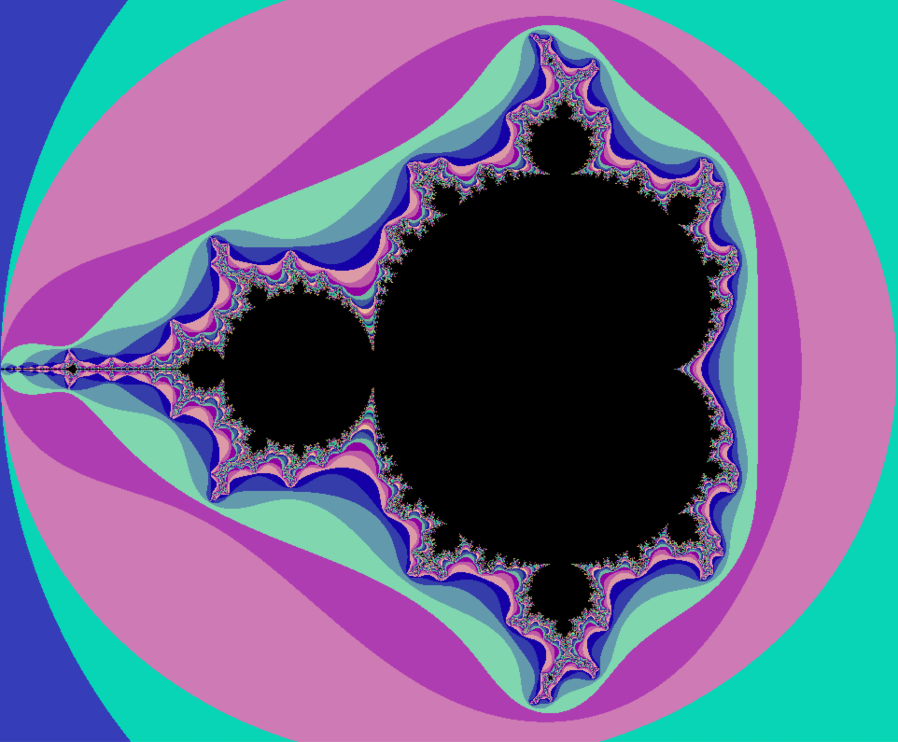
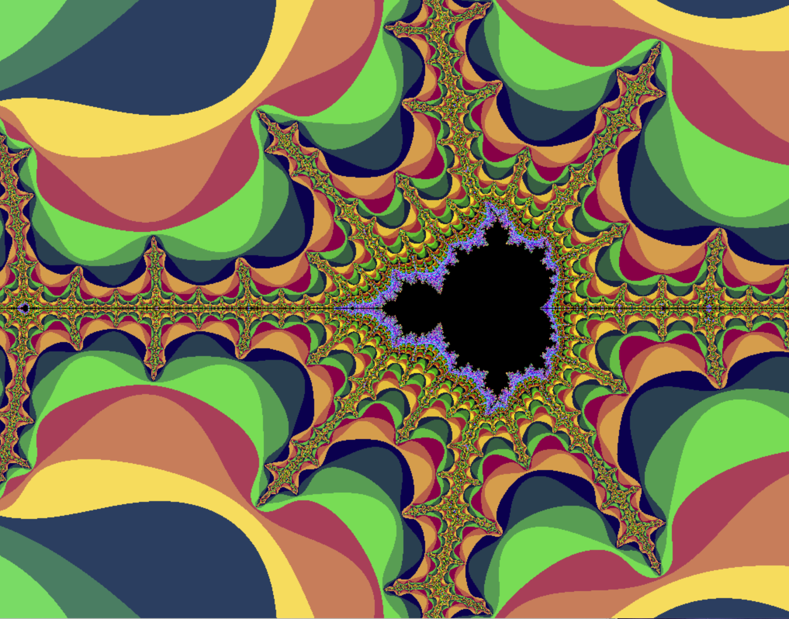
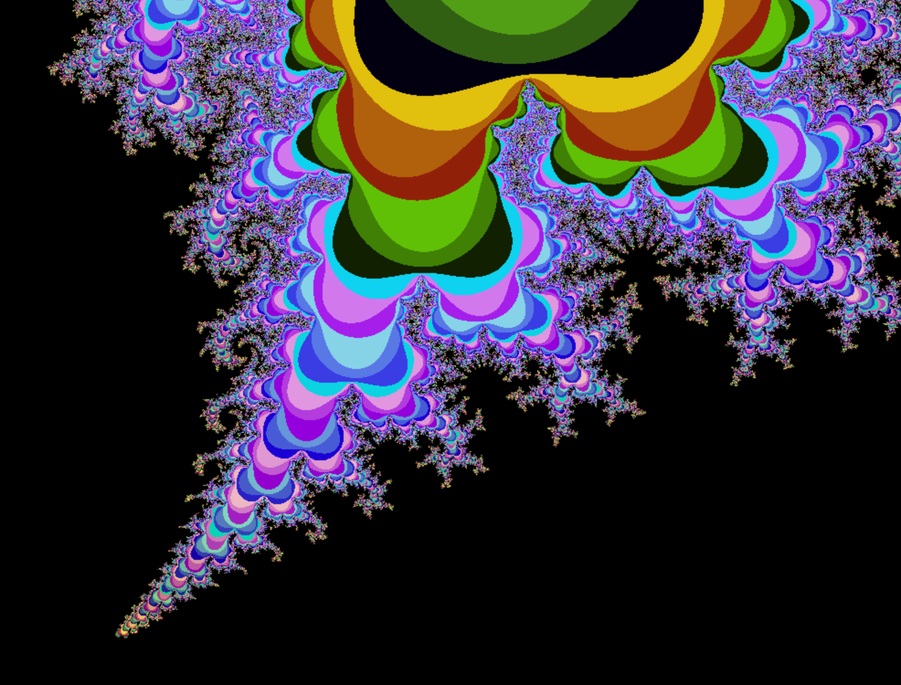

<h2>Programa en Lenguage C</h2>

<h3>Representacion gráfica de los fractales Mandelbrot y Julia</h3>

  Uso de las funciones de zoom con el ratón y desplazaminto por la pantalla con las flechas del teclado
  
proyecto desarrollado para 42_Barcelona

 

</img>

</img>

</img>

</img>
